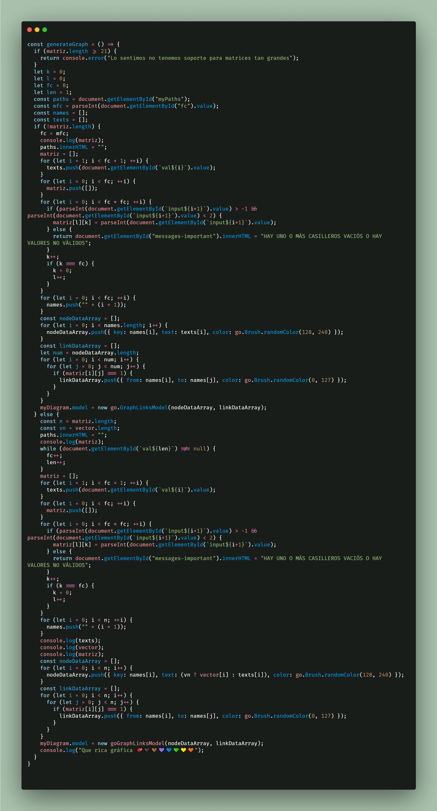

# ProyectoRelacionesyGrafos
- Este proyecto tratara de la creación de relaciones y grafos con html, css y js.

### Requisitos

- Ir al sitio oficial de GoJS y descargar los releases de la pagina
de recomendación la versión más reciente. 

- Descarga aquí [GoJs](https://gojs.net/latest/download.html)

```javascript

const generarMatriz = () => {
  if (!validateSecond()) {
    return document.getElementById("messageValid2").innerHTML = "NO SE PUEDE GENERAR LA MATRIZ";
  } else {
    document.getElementById("messageValid2").innerHTML = "SI SE PUDO GENERAR LA MATRIZ";
  }
  const n = vector.length;
  const value1 = document.getElementById("expression9").value;
  const condition2 = document.getElementById("expression8").value;
  let text = document.getElementById("expression7").value;
  text += "=" + value1;
  matriz = [];
  for (let i = 0; i < n; ++i) {
    matriz.push([]);
  }
  if (condition2 === "=") {
    for (let i = 0; i < n; ++i) {
      const x = "x=" + vector[i];
      const solution = nerdamer.solveEquations([text, x]);
      let relacion = 0;
      if (solution[0][1] <= vector[n - 1] && solution[0][1] >= vector[0]) {
        if (solution[1][1] <= vector[n - 1] && solution[1][1] >= vector[0]) {
          relacion = 1;
        }
      }
      for (let j = 0; j < n; ++j) {
        if (vector[j] === solution[1][1]) {
          matriz[i][j] = relacion;
        } else {
          matriz[i][j] = 0;
        }
      }
    }
  } else {
    for (let i = 0; i < n; ++i) {
      for (let j = 0; j < n; ++j) {
        console.log(vector);
        const x = "x=" + vector[i];
        const solution = nerdamer.solveEquations([text, x]);
        let relacion = 0;
        console.log(solution);
        if (condition2 === ">") {
          if (solution[1][1] < vector[j]) {
            relacion = 1;
          }
        } else if (condition2 === ">=") {
          if (solution[1][1] <= vector[j]) {
            relacion = 1;
          }
        } else if (condition2 === "<") {
          if (solution[1][1] > vector[j]) {
            relacion = 1;
          }
        } else {
          if (solution[1][1] >= vector[j]) {
            relacion = 1;
          }
        }
        matriz[i][j] = relacion;
      }
    }
  }
  const doc = document.getElementById("stock");
  let numInputs = 1;
  let val = 1;
  doc.innerHTML = "";
  if (fc >= 20) {
    return document.getElementById("stock").innerHTML = "LO SENTIMOS NO TENEMOS SOPORTE PARA MATRICES TAN GRANDES";
  }
  for (let i = 0; i < n + 1; ++i) {
    doc.innerHTML += `<div>`
    for (let j = 0; j < n + 1; ++j) {
      if (i !== 0 && j !== 0) {
        doc.innerHTML += `<input type="number" id="input${numInputs}" min="0" max="1" value="${matriz[i-1][j-1]}" class="inputs-array">`
        numInputs++;
      } else {
        if (i === 0 && j === 0) {
          doc.innerHTML += `<input id="val${0}" class="inputs-array" value="n">`;
          continue;
        }
        if (i !== 0) {
          doc.innerHTML += `<input id="val${val}" class="inputs-array" value="${vector[i-1]}">`;
        }
        if (j !== 0) {
          doc.innerHTML += `<input id="val${val}" class="inputs-array" value="${vector[j-1]}">`;
        }
        val++;
        if (val === n + 1) {
          val = 1;
        }
      }
    }
    doc.innerHTML += `</div>`
  }
  console.log(matriz);
}
```

### Versión Actual de graficación



### Autores:
- Roca Hormaza Joan 🧡
- Fabian Sinti Estefany💙
- Medrano Quispe Samuel💚
- Muñoz Ingaruca Piero💛

## 😎😎😎😎😎😎😎😎😎😎😎[💙](https://github.com/Johan769)

### End
